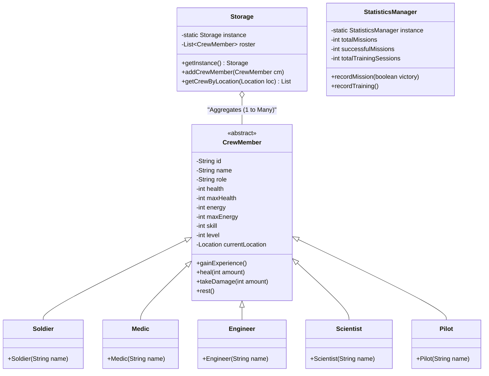
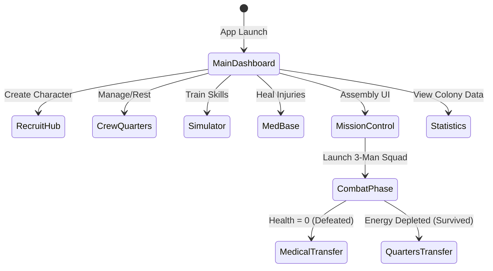

# 🚀 SCM Simulator - Project Documentation

## 1. Project Description
**SCM Simulator (Space Colony Management Simulator)** is an immersive, turn-based tactical Android strategy game built natively in Java. It allows players to recruit personnel for a space colony, train their skill levels, manage their fatigue and health, and deploy them into tactical, animated combat encounters against alien threats. 

The application utilizes dynamic state tracking—moving distinct Crew Member objects between Locations (Quarters, Simulator, Med Base, Mission Control) while sustaining their individual health and energy metrics natively during application runtime.

---

## 2. Implementation Overview
The application adheres strictly to standard Object-Oriented Programming (OOP) paradigms (Encapsulation, Inheritance, Polymorphism) deployed over native Android SDK Architecture.

*   **Logic Layer**: Written `100% in Java`. Utilizes scalable patterns like **Singletons** (`Storage.java`, `StatisticsManager.java`) to establish a centralized data persistence model without tightly coupling Activities.
*   **Data Models**: Uses deep Class inheritance. An abstract `CrewMember` superclass defines the baseline API, which classes like `Medic`, `Soldier`, and `Engineer` inherit from to alter functional logic (like combat effects).
*   **UI/Presentation**: Built securely with verbose XML layouts (`ConstraintLayout`, `RelativeLayout`, `LinearLayout`) utilizing styled Material Components. Uses pure Android Native `ObjectAnimator` workflows to decouple complex Combat VFX (Visual Effects) from layout constraints cleanly.

---

## 3. System Architecture (UML Diagrams)

### Class Diagram: Polymorphism & Singleton Data Structures
This diagram explores how the centralized `Storage` Singleton natively aggregates the diverse polymorphic classes extending from the abstract `CrewMember` core logic block. 

---

## 4. Application Use-Flow
The gameplay loop operates through distinct segmented hubs accessible via the Main Dashboard. Characters physically transition states (using Enums) to lock or unlock availability across distinct systems dynamically.

**Step-by-Step Flow:**
1.  **Generate**: User visits *Recruit* to generate avatars parsing data into objects.
2.  **Manage**: Users navigate *Quarters* using Spinners transferring valid bodies to Simulator or Mission configurations.
3.  **Upgrade**: The *Training Simulator* burns character energy to permanently increment skill levels.
4.  **Encounter**: *Mission Control* ensures squad validation, locking elements to a 3-man deployment.
5.  **Battle**: Native turn-based RPG phase tracking HP strings and Action-Queue phases.

---

## 5. Installation Instructions
1.  Have **Android Studio (Giraffe/Hedgehog or Latest)** installed with Android SDK tools.
2.  Clone or download the project folder.
3.  Open the directory in Android Studio.
4.  Wait for Gradle Sync to successfully index packages.
5.  Click the Green **Run** arrow at the top-right toolbar targeting an Emulator (API 28+) or physically connected Debugging Android device.

---

## 6. Project Links
*   **GitHub Repository**: `[URL HERE]`
*   **Video Demonstration**: `[URL HERE]`

---

## 7. Team Composition & Work Distribution

| Student Name | Project Role / Responsibilities |
| :--- | :--- |
| **Krishna Suri** | Handles UI design and Android implementation |
| **Muhammad Musa Adnan** | Handles core logic (classes, mission system) |

**How Work Was Shared**: 
We utilized a modular component architecture strategy. Muhammad primarily focused on programming the core backend OOP logic (the polymorphic `CrewMember` abstractions, singletons, and mission calculations). Krishna built the frontend architecture, mapping the Android XML bindings, orchestrating the dynamic UI transitions, and configuring visual effects to bridge the logic into a playable experience.

---

## 8. Tools Used
*   **Framework**: Native Android SDK (Java)
*   **IDE**: Android Studio
*   **Architecture**: View-Controller mapping (Android Activities mapped tightly to Layouts)
*   **Version Control**: Git / GitHub
*   **Visual Assets**: Material Design Libraries, Custom XML Vector Drawables

---

## 9. ⭐ Bonus Features Implemented
While achieving the core requirements, several Advanced Bonus Features were natively programmed into the engine simulating modern Mobile Gaming paradigms:

1.  **Fully Animated Combat VFX:** Eliminated simple text-based logs by integrating fluid dynamic Android `ObjectAnimator`. Combat phases feature generated coordinate-seeking Fireballs across the X-Axis natively striking target sprites. 
2.  **State-Reactive UI Scaling:** During gameplay, the current turn’s active participant triggers `ViewPropertyAnimator` scaling and dynamic XML padding expansion overriding Android framework rules to create physical JRPG-feel "popping" highlighting pushing siblings aside.
3.  **Algorithmic XML Drawables:** Instead of expensive raster PNG assets, protective force-fields and special ability aura explosions were programmed as geometric mathematical XML models triggered by alpha-fade animations.
4.  **Universal Color Styling:** Overwrote base Android standard Purple layouts using overarching hex color coordination (`#008B8B` Cyan) injecting a uniform space-age aesthetic spanning ActionBars down to XML layout Strokes without library bloat.
5.  **Robust Error Bounds:** Dynamic adapters automatically disable deployment sequence buttons scaling UI constraints if invalid objects attempt transitions.
